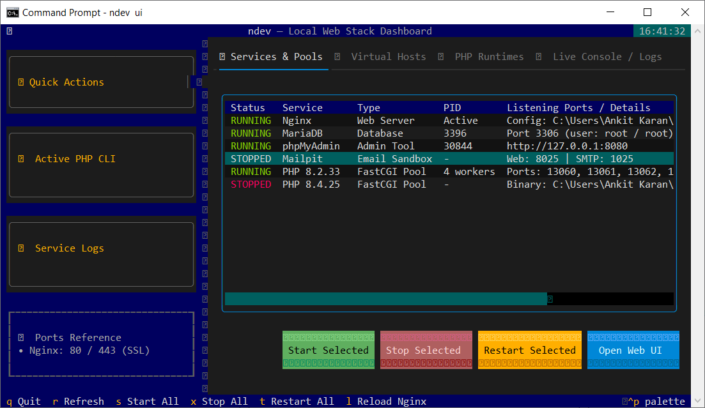

# ndev

`ndev` is a powerful, non-root / non-admin developer tool suite to manage, run, and isolate PHP runtimes (PHP-FPM on Linux, FastCGI worker pools on Windows), PECL extensions, MySQL/MariaDB databases, Nginx virtual hosts, trusted local SSL certificates, Mailpit email sandbox, and public HTTP tunneling natively on **Linux** (Debian/Ubuntu) and **Windows 10/11**.

A single unified repository and package with automatic OS detection that uses native operating system primitives for each platform.

<p align="center">
  
</p>

---

## Key Features

- **Multi-Version PHP Management**:
  - **Linux**: Sandboxed source compilation (`5.6` – `8.5`) inside an unprivileged `bubblewrap` environment with custom, self-healing multiarch paths.
  - **Windows**: Instant zero-compilation prebuilt official binaries from `windows.php.net` (NTS & TS, x64 & x86).
- **Process & Daemon Model**:
  - **Linux**: Isolated native `php-fpm` worker pools communicating over Unix domain sockets (`~/.ndev/run/php<ver>.sock`).
  - **Windows**: Deterministic multi-process `php-cgi.exe` FastCGI worker pools load-balanced by Nginx `upstream` blocks.
- **Interactive Terminal UI Dashboard (`ui` / `tui` / `dashboard`)**: Modern, asynchronous Textual TUI dashboard for real-time stack monitoring, live auto-refresh, quick batch actions (Start/Stop/Restart All), active CLI PHP switching, integrated log tailing, and virtual host launching.
- **Interactive Control Menu (`ctl`)**: Unified terminal service selector to monitor and control Nginx, MariaDB, phpMyAdmin, and PHP instances.
- **Nginx Virtual Host Manager (`vhost`)**: Automated Nginx server blocks with custom upstreams, canonical HTTP $\rightarrow$ HTTPS redirects, trusted local SSL certificate generation (`mkcert`), and `/etc/hosts` / Windows `hosts` mapping.
- **SQL Database Manager (`db`)**: Interactive wizard and CLI suite to create/drop databases, manage users, grant permissions, and export SQL dumps (`mysqldump`).
- **PECL Extension Manager (`ext`)**: Compiles or downloads precompiled PECL `.dll` / `.so` binaries (Redis, Xdebug, etc.) and enables/disables them per PHP version.
- **Local Email Sandbox (`mailpit`)**: Zero-dependency local SMTP email catcher & modern web UI (`http://127.0.0.1:8025`) using prebuilt binaries.
- **phpMyAdmin Background Service (`pma`)**: One-command background phpMyAdmin service management served locally over `http://127.0.0.1:8080`.
- **Public HTTP Tunneling (`grok`)**: Interactive ngrok tunnel launcher to proxy local virtual hosts over the web with automatic Host header rewriting.
- **Automated Stack Setup (`setup`)**:
  - **Linux**: Installs MariaDB, Nginx, Composer, and creates symlinks in `~/.local/bin/`.
  - **Windows**: Portable zero-installer extraction of Nginx, MariaDB, mkcert, ngrok, Mailpit, Composer, and CA bundles under `%USERPROFILE%\.ndev\` with global batch shims on `PATH`.

---

## Platform Differences: Linux (`ndev`) vs. Windows (`ndev`)

| Subsystem | Linux (`ndev`) | Windows (`ndev`) |
| :--- | :--- | :--- |
| **PHP Distribution** | Compiles PHP from official source using `bubblewrap` sandbox and `gcc`/`make` | Downloads official precompiled Windows builds from `windows.php.net` (NTS & TS, x64 & x86) |
| **Process Model** | Native `php-fpm` daemon with Unix domain sockets (`~/.ndev/run/php<ver>.sock`) | Multi-process worker pool of `php-cgi.exe` instances over deterministic TCP ports (`13000+`), balanced via Nginx `upstream` |
| **CLI & PATH Switching** | Linux symlinks in `~/.local/bin/` (`php`, `composer`, `ndev`) pointing to `~/.ndev/current/` | Windows batch shims in `%USERPROFILE%\.ndev\shims\` (`php.bat`, `composer.bat`, `ndev.bat`) |
| **Privilege Elevation** | `sudo` for Nginx and `/etc/hosts` changes | Scoped Windows UAC elevation via Win32 `ShellExecuteExW` (`runas`) only when updating `hosts` file |
| **Web Server** | Host system package installed via `apt install nginx` (`/etc/nginx/`) | Portable standalone Nginx zip extracted to `%USERPROFILE%\.ndev\nginx\` |
| **Database** | Host system package installed via `apt install mariadb-server` | Portable MariaDB zip extracted to `%USERPROFILE%\.ndev\mariadb\` initialized via `mariadb-install-db.exe` |
| **PECL Extensions** | Source compilation (`phpize`, `./configure`, `make`) within build sandbox | Precompiled official PECL `.dll` downloads matching PHP version, VS compiler (`vs16`, `vs17`), and thread safety |
| **Email Sandbox** | Prebuilt Linux Mailpit binary in `~/.ndev/bin/mailpit` | Prebuilt Windows Mailpit binary in `%USERPROFILE%\.ndev\shims\mailpit.exe` |
| **phpMyAdmin** | Served via PHP's built-in web server (`php -S 127.0.0.1:8080`) | Served via PHP's built-in web server (`php.exe -S 127.0.0.1:8080`) |
| **Local SSL** | `mkcert` package via `apt` (`~/.ndev/certs/`) | Portable `mkcert.exe` downloaded into `%USERPROFILE%\.ndev\shims\` |
| **TUI Dashboard** | Asynchronous Textual TUI (`ndev ui`) with live auto-refresh | Asynchronous Textual TUI (`ndev ui`) with live auto-refresh |

---

## Directory Structure & Layout

### Linux Layout (`~/.ndev`)
```text
~/.ndev/
├── bin/                    # Standalone binaries (mailpit)
├── builds/                 # Source tarballs and compilation build directories
├── cache/                  # Download and build cache
├── certs/                  # Local SSL certificates and mkcert root CA
├── chroot/                 # Sandboxed development packages and build root
├── downloads/              # Downloaded source archives
├── logs/                   # Service and daemon logs (pma.log, mailpit.log, etc.)
├── php/
│   └── <version>/          # Compiled PHP installations (bin/, sbin/, etc/php.ini, etc/php-fpm.d/)
├── phpmyadmin/             # Standalone phpMyAdmin installation & config.inc.php
├── run/                    # Active PID and Unix domain socket files (*.sock, *.pid)
├── current                 # Symlink pointing to the currently active PHP version directory
├── mailpit.db              # Persistent message database for Mailpit
└── config.toml             # Global build and runtime configuration
```

### Windows Layout (`%USERPROFILE%\.ndev`)
```text
%USERPROFILE%\.ndev\
├── certs\                  # Local SSL certificates and cacert.pem CA bundle
├── downloads\              # Cached zip downloads
├── mariadb\                # Portable MariaDB installation & data directory
│   ├── bin\                # mysqld.exe, mysql.exe, mysqldump.exe
│   └── data\               # Database storage
├── nginx\                  # Portable Nginx installation
│   ├── conf\
│   │   ├── nginx.conf      # Main Nginx config (patches include ndev-vhosts/*.conf)
│   │   └── ndev-vhosts\    # Virtual host configurations (*.conf)
│   ├── logs\               # Nginx access/error logs per virtual host
│   └── temp\               # FastCGI and proxy client temporary body storage
├── php\
│   └── <version>\          # Extracted PHP binaries (php.exe, php-cgi.exe, php.ini, ext/)
├── pma\                    # Standalone phpMyAdmin installation & config.inc.php
├── run\                    # Active PID and FastCGI worker state files (JSON)
├── shims\                  # Global batch shims for PATH (php, composer, mysql, mailpit, ndev, etc.)
├── mailpit.db              # Persistent message database for Mailpit
└── config.json             # Global configuration (ports, worker counts)
```

---

## Quick Start & Installation

### Linux (Debian / Ubuntu)

```bash
# 1. Install prerequisites
sudo apt update
sudo apt install -y bubblewrap build-essential pkg-config nginx mkcert default-mysql-client
mkcert -install

# 2. Clone repository & install in editable mode
git clone https://github.com/ankitkaran99/ndev.git
cd ndev
python3 -m venv .venv
.venv/bin/pip install -e .

# 3. Setup system components and local shims
.venv/bin/ndev setup

# 4. Add ~/.local/bin to your PATH
export PATH="$HOME/.local/bin:$PATH"
```

### Windows 10 / 11

```powershell
# 1. Clone repository & install in editable mode
git clone https://github.com/ankitkaran99/ndev.git
cd ndev
python -m venv .venv
.venv\Scripts\Activate.ps1
pip install -e .

# 2. Download and configure all portable components
ndev setup

# 3. Add shims to user PATH
[Environment]::SetEnvironmentVariable("Path", $env:Path + ";$env:USERPROFILE\.ndev\shims", "User")
```

---

## Quick Command Reference

| Command | Action |
|---|---|
| `ndev ui` | Launch real-time Textual TUI dashboard (*aliases: `tui`, `dashboard`*) |
| `ndev available` | List available PHP releases (`--archives` for legacy versions) |
| `ndev install <ver>` | Install / compile a PHP version (`8.4`, `8.3`, `7.4`) |
| `ndev use <ver>` | Switch active CLI PHP version on PATH |
| `ndev current` | Show active CLI PHP version |
| `ndev list` | List installed PHP versions and daemon / worker pool status |
| `ndev start <target>` | Start service or pool (`all`, `nginx`, `mariadb`, `pma`, `mailpit`, `<ver>`) |
| `ndev stop <target>` | Stop service or pool (`all`, `nginx`, `mariadb`, `pma`, `mailpit`, `<ver>`) |
| `ndev restart <target>`| Restart service or pool (`all`, `nginx`, `mariadb`, `pma`, `mailpit`, `<ver>`) |
| `ndev reload nginx` | Reload Nginx configuration without downtime |
| `ndev status` | View real-time service status dashboard |
| `ndev ctl` | Interactive terminal service control menu |
| `ndev vhost` | Interactive virtual host creation wizard with local SSL |
| `ndev vhost-list` | List all configured virtual hosts |
| `ndev vhost-remove` | Remove virtual host and clean up hosts file |
| `ndev db` | Interactive SQL database management wizard |
| `ndev ext` | Manage PECL extensions (`list`, `install`, `enable`, `disable`) |
| `ndev mailpit` | Manage local email sandbox (`install`, `start`, `stop`, `launch`, `open`) |
| `ndev pma` | Manage phpMyAdmin background service (`http://127.0.0.1:8080`) |
| `ndev grok` | Public HTTP tunneling for local virtual hosts via ngrok |
| `ndev upgrade` | Check for and upgrade stack components (Nginx, Mailpit, MariaDB, PMA, mkcert, Composer) |
| `ndev upgrade --check` | Check component versions against upstream releases without upgrading |
| `ndev shell` | Interactive developer subshell pre-loaded with PHP/Composer/MySQL on PATH |
| `ndev doctor` | Run environment diagnostics and health checks |
| `ndev logs` | View and tail service and virtual host logs |
| `ndev clean` | Clean up downloads cache and stale runtime state |

---

## Usage Guide

### PHP Version Management

```bash
# List available PHP versions from php.net / windows.php.net
ndev available
ndev available --archives    # include legacy releases

# Install a PHP version (compiled on Linux, downloaded on Windows)
ndev install 8.4

# List locally installed PHP versions and daemon/pool status
ndev list

# Switch globally active CLI PHP version
ndev use 8.4

# Show current active CLI PHP version
ndev current

# Check for newer minor/patch releases
ndev update

# Uninstall a PHP version
ndev uninstall 7.4
```

---

### Process & Service Management

```bash
# Start / Stop / Restart a PHP pool or service
ndev start 8.4
ndev stop 8.4
ndev restart 8.4

# Control Nginx, MariaDB, phpMyAdmin, or Mailpit
ndev start nginx
ndev start mariadb
ndev start pma
ndev start mailpit
ndev start all

# Stop or restart all services
ndev stop all
ndev restart all

# Reload Nginx configuration without downtime
ndev reload nginx

# View service status dashboard
ndev status
ndev status 8.4
ndev status pma
ndev status mailpit
```

---

### Interactive Terminal UI Dashboard (`ui` / `dashboard`)

Launch the modern, responsive Textual TUI dashboard for real-time monitoring and process control:

```bash
ndev ui
# Aliases: ndev tui, ndev dashboard
```

* **Live Status Dashboard**: Real-time health, PIDs, sockets/ports for Nginx, MariaDB, PMA (phpMyAdmin), Mailpit, and all PHP instances.
* **One-Click Component Setup & Upgrades**: Install uninstalled services (**PMA**, **Mailpit**, **Nginx**, **MariaDB**, **mkcert**, **Composer**) or check/upgrade stack releases with single-click UI actions.
* **Interactive Virtual Host Manager**: Create new virtual hosts (`＋ Create VHost`) with automatic mkcert SSL and docroot binding via modal dialog, or delete existing vhosts with full cleanup.
* **PHP Runtime Lifecycle**: Install new PHP runtimes (`＋ Install PHP`) from upstream releases, uninstall versions (`✖ Uninstall Selected`), switch active CLI version, or start/stop individual FastCGI pools.
* **Quick Batch Actions**: One-click **Start All**, **Stop All**, **Restart All**, and **Reload Nginx** from the persistent sidebar.
* **On-the-fly CLI PHP Switcher**: Change globally active CLI PHP version instantly via dropdown.
* **Integrated Log Tail Viewer**: Select and inspect live tails for Nginx, MariaDB, PHP, and Virtual Host logs.
* **Asynchronous & Non-Blocking**: Built with Textual workers — all background actions and I/O polling run smoothly without freezing the UI.

---

### Interactive CLI Control Menu (`ctl`)

Launch the interactive terminal service selector:
```bash
ndev ctl
```

---

### Virtual Host Management (`vhost`)

Create and manage local Nginx sites mapped to `127.0.0.1`:

```bash
# Interactive wizard
ndev vhost

# Create a standard HTTP virtual host
ndev vhost --domain project.local --root /path/to/project --php 8.4

# Create an HTTPS virtual host with trusted local SSL certificates (mkcert)
ndev vhost --domain project.local --root /path/to/project --php 8.4 --ssl

# List all configured virtual hosts
ndev vhost-list

# Remove a virtual host
ndev vhost-remove --domain project.local
```

---

### SQL Database Manager (`db`)

Manage MySQL/MariaDB databases and users:

> [!TIP]
> **Default MariaDB / MySQL Credentials**:
> * **Host**: `127.0.0.1` or `localhost`
> * **Port**: `3306`
> * **Username**: `root`
> * **Password**: `root` (Windows) / system auth (Linux)

```bash
# Launch interactive database wizard
ndev db

# Create a database
ndev db create-db mydb --owner myuser

# Create a database user with privileges
ndev db create-user myuser --new-password secret --grant-db mydb

# Export database dump
ndev db export-db mydb -o backup.sql

# Import database dump
ndev db import-db mydb backup.sql

# Drop a database
ndev db drop-db mydb
```

---

### PECL Extension Manager (`ext`)

Manage PECL extensions for any installed PHP version:

```bash
# List loaded extensions for a PHP version
ndev ext list 8.4

# Install a PECL extension (e.g. redis, xdebug)
ndev ext install redis 8.4

# Enable or disable an extension
ndev ext enable redis 8.4
ndev ext disable redis 8.4
```

---

### phpMyAdmin Management (`pma`)

Manage the phpMyAdmin database administration web UI served locally in the background:

> [!TIP]
> **phpMyAdmin Access & Credentials**:
> * **URL**: [http://127.0.0.1:8080](http://127.0.0.1:8080)
> * **Default Username**: `root`

```bash
# Start phpMyAdmin on port 8080 (auto-installs on first run)
ndev start pma

# Check status
ndev status pma

# Stop or restart phpMyAdmin
ndev stop pma
ndev restart pma
```

---

### Local Email Sandbox (`mailpit`)

Catch every outgoing e-mail your local project sends without hitting real inboxes, using [Mailpit](https://github.com/axllent/mailpit) — a fast, zero-dependency prebuilt binary with a modern web UI.

> [!TIP]
> **SMTP & Web UI Defaults**:
> * **SMTP server** → `127.0.0.1:1025` ← point your PHP / Laravel / WordPress app here
> * **Web inbox**   → [http://127.0.0.1:8025](http://127.0.0.1:8025)
> * No authentication required — every sent email is safely captured locally.

```bash
# Install prebuilt binary from GitHub releases
ndev mailpit install

# Start the sandbox (auto-downloads if not present)
ndev mailpit start
ndev start mailpit

# Launch / open Web UI in your default browser
ndev mailpit launch
ndev mailpit open

# View status
ndev mailpit status
ndev status mailpit

# Stop or restart
ndev mailpit stop
ndev stop mailpit
ndev mailpit restart
ndev restart mailpit

# Custom ports
ndev mailpit start --smtp-port 2525 --web-port 8085
```

#### Configuring your PHP project to use Mailpit

**Laravel (`.env`):**
```env
MAIL_MAILER=smtp
MAIL_HOST=127.0.0.1
MAIL_PORT=1025
MAIL_USERNAME=null
MAIL_PASSWORD=null
MAIL_ENCRYPTION=null
```

**Native PHP (`php.ini`):**
```ini
[mail function]
SMTP      = 127.0.0.1
smtp_port = 1025
```

**WordPress (`wp-config.php` / SMTP Plugin):**
* **Host**: `127.0.0.1`
* **Port**: `1025`
* **Encryption**: None / Plain
* **Authentication**: None / No

Or via Symfony Mailer / PHPMailer / Python / Node.js — just send SMTP traffic to `127.0.0.1:1025`.

---

### Interactive Developer Shell (`shell`)

Open an interactive shell pre-configured with active PHP, Composer, MySQL, and Nginx on your `PATH`:

```bash
ndev shell
```

---

### Public HTTP Tunneling (`grok`)

Tunnel any configured local virtual host to the public web via `ngrok`:

```bash
ndev grok
```

---

### Diagnostics & Log Viewing

```bash
# Run environment diagnostics
ndev doctor

# View / tail logs
ndev logs
ndev logs 8.4

# Clean download cache and temporary files
ndev clean
```

---

## Configuration

### Linux
* **Global Configuration**: `~/.ndev/config.toml`
* **PHP Configuration (`php.ini`)**: `~/.ndev/php/<version>/etc/php.ini`
* **Extension Configurations (`conf.d/`)**: `~/.ndev/php/<version>/etc/conf.d/<ext>.ini`
* **PHP-FPM Server Configuration**: `~/.ndev/php/<version>/etc/php-fpm.conf`
* **PHP-FPM Pool Configuration**: `~/.ndev/php/<version>/etc/php-fpm.d/www.conf`

### Windows
* **Global Configuration**: `%USERPROFILE%\.ndev\config.json`
* **PHP Configuration (`php.ini`)**: `%USERPROFILE%\.ndev\php\<version>\php.ini`
* **Nginx Configuration**: `%USERPROFILE%\.ndev\nginx\conf\nginx.conf`
* **Virtual Host Configs**: `%USERPROFILE%\.ndev\nginx\conf\ndev-vhosts\*.conf`
* **FastCGI Worker Pools**: Configurable base port (default: `13000`) and workers per version (default: `4`) in `config.json`.
